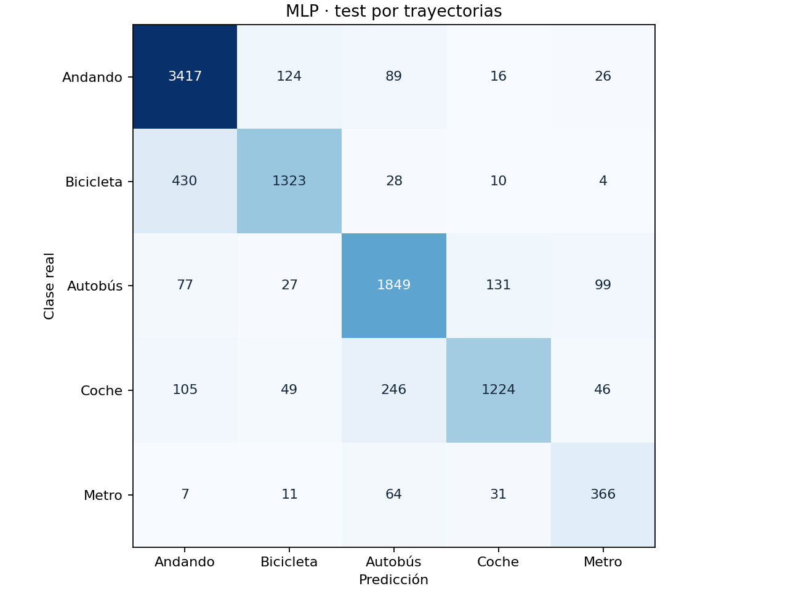
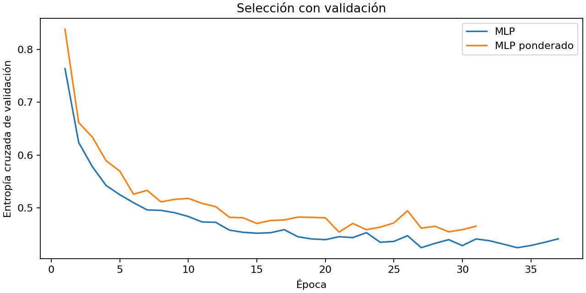

# Resultado reproducible

Semilla: 42. Partición: **track**. Modelo seleccionado con F1 macro de validación: **MLP**.

| Modelo | Accuracy test | F1 macro test |
|---|---:|---:|
| Clase mayoritaria | 0.3747 | 0.1090 |
| Regresión logística | 0.7734 | 0.7361 |
| MLP | 0.8347 | 0.8045 |

Las trayectorias y los usuarios compartidos se detallan en metrics.json. La partición por trayectoria permite usuarios comunes entre conjuntos; no mide la generalización a personas nuevas.
